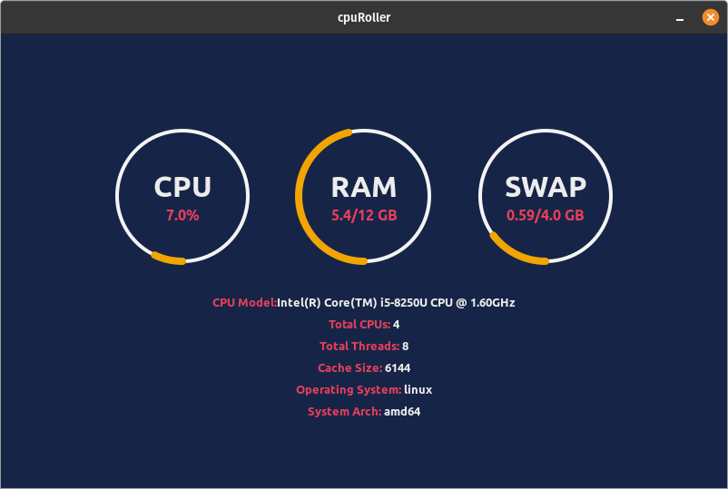

### About

Simple Cross Platform Desktop application for seeing your CPU and RAM utilization with an intuitive design. Available natively on Windows, Linux and MacOS.

This project is open sourced on Github. If you want to learn more about this project or want to contribute to it head over to project's repo [here](https://github.com/sarthakpranesh/CpuRoller)

### Downloads
You'll need to perform some minor extra steps to run this app on specific platforms

##### Linux (Debian/Ubuntu):

[Download for Linux](https://github.com/sarthakpranesh/CpuRoller/releases/download/v1.1.2/cpuRoller_1.1.2_amd64.deb)

Install using Eddy:
1. Just double click the downloaded package, it should automatically open in Eddy
2. Follow the installation process in Eddy and you are done

Install using Terminal:
1. Open a terminal and cd where your package was downloaded
2. Run the following to use `dpkg` to install the package on your system:
```bash
sudo dpkg -i cpuRoller_x.x.x_amd64.deb
```

##### Windows:
[Download for Windows](https://github.com/sarthakpranesh/CpuRoller/releases/download/v1.1.2/cpuRoller-windows-4.0-amd64.exe)

You don't require to install this app. Directly run the .exe file to start the program. You might get a warning dialog from Windows, if so then click on `more info` which will display a `run anyway` option that can be used to start the program.

##### MacOS:
[Download for MacOS](https://github.com/sarthakpranesh/CpuRoller/releases/download/v1.1.2/cpuRoller.app.zip)

Extract the .zip file, and right click on the app. Select open from the dialog menu. Give the app required permission to run and your app will start.

### Findings
In this section I will be discussing the main issues I faced/facing while developing this project. This will also provide others an insight what they might come across with such cross platform projects.

##### Window's msHtml problem
The project was developed using Wails, which uses msHtml (essentially IE11) on Windows. The problems with msHtml compatibility are very significant and adding to this it does not have developer console. One such example is the way it positions elements when using `position: 'absolute';` which is quite different from how other engines do it. To center elements with position set to absolute, the only work around was to hard code your element's position like [here](https://github.com/sarthakpranesh/CpuRoller/blob/master/frontend/src/components/CircularUsage/styles.css#L12)

##### Linux packaging
You might be thinking 'how can this be even a problem?'. The thing is, it is more of a very very tedious task then a problem. Their is no such said problem with packaging Linux apps, the issue arises because of the different types, flavours and desktop environments being used in the ever increasing number of Linux distributions ([Linux distribution family tree](https://distrowatch.com/dwres.php?resource=family-tree)). 

For packaging on Linux we first have to deal with different types of packaging formats such as `.deb` and `.rpm`. Then we have to deal with different desktop environments, if we want our application to properly integrate in the user's desktop, as some of them might require curtain different configurations. Even after this, it is not curtain that our application is bound to run without any issues, so we have test our builds on different distributions. From the above explanation it becomes clear about how packaging for Linux can become a project in itself.

To ease some of this work load we can employee some scripts (I package for Debian using [this](https://github.com/sarthakpranesh/CpuRoller/blob/master/debian-build.sh) script I made). The easiest way to distribute your apps on Linux might be using AppImages, Flatpak or Snaps (Wails v2 might provide packaging to Flatpak, see [here](https://github.com/wailsapp/wails/issues/559)). But these approaches do have their disadvantages, a common one being the increased app size.

##### Data Retrieval Inconsistency
The project utilizes the [gopsutil](https://github.com/shirou/gopsutil) for retrieving the usage information and hardware details about the system. The problem is that the library gives different results on different operating systems specially on Windows. As of now I am handling this manually in the app itself [here](https://github.com/sarthakpranesh/CpuRoller/blob/master/frontend/src/App.js#L27), but I look forward to the future versions of this library to fix these issues.

### Concluding
CpuRoller turned out to be good learning experience for me, as I learned more about managing cross platform applications. It also displays how cross platform development tools such as Wails and others are actually becoming more stable and increasingly consistent on providing compatibility on different platforms.
